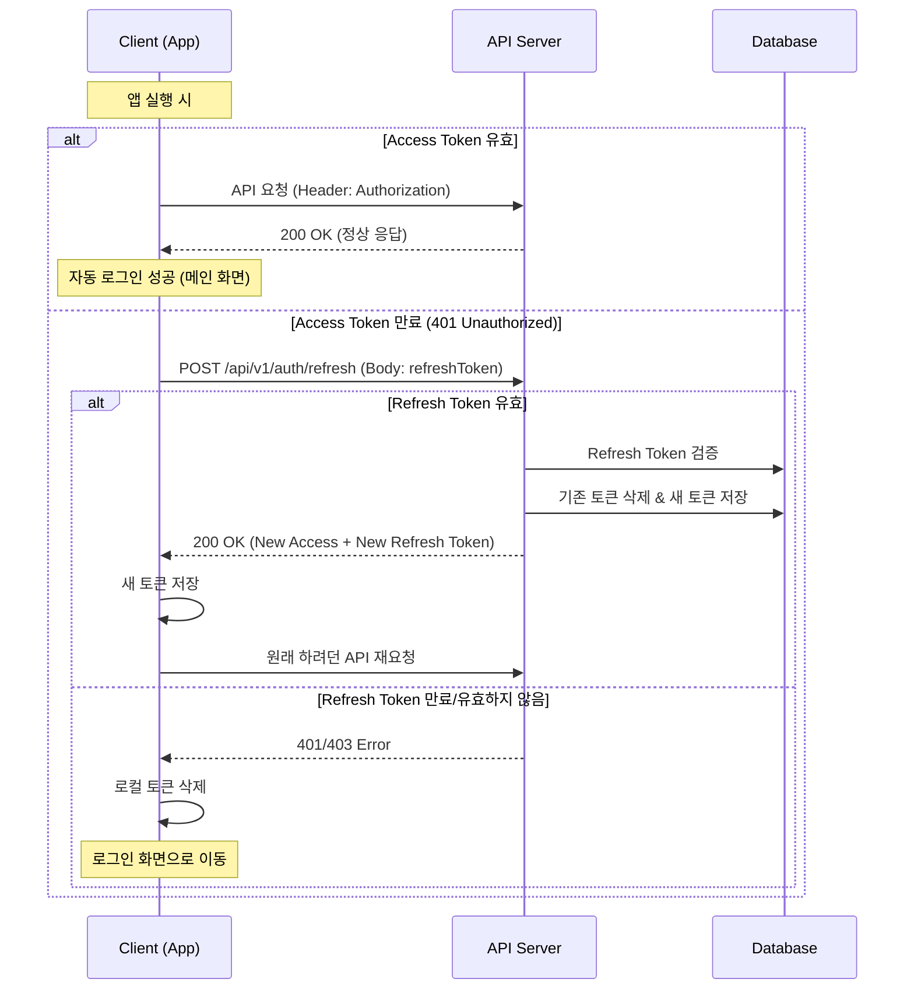

# 앱 자동 로그인 및 인증 시스템 상세 설계서

**버전:** v1.0
**작성일:** 2026-01-08

---

## 1. 개요 (Overview)
본 문서는 모바일 앱의 **자동 로그인(Auto Login)** 기능을 지원하기 위한 서버 측 인증 시스템의 상세 설계 및 클라이언트 연동 가이드를 정의합니다.
기존의 JWT 기반 인증 구조를 활용하되, 발견된 버그를 수정하고 보안성을 강화하는 방향으로 진행합니다.

## 2. 인증 메커니즘 (Authentication Mechanism)

### 2.1 토큰 정책 (Token Policy)
| 토큰 종류 | 유효 기간 | 저장소 (Client) | 저장소 (Server) | 용도 |
|---|---|---|---|---|
| **Access Token** | 30분 | Secure Storage | 없음 (Stateless) | API 요청 인증 |
| **Refresh Token** | 30일 | Secure Storage | DB (refresh_tokens) | Access Token 재발급 |

### 2.2 Refresh Token Rotation (RTR)
보안 강화를 위해 `Access Token` 재발급 요청 시 `Refresh Token`도 함께 재발급(교체)하는 정책을 사용합니다.
- 한 번 사용된 Refresh Token은 폐기됩니다.
- 탈취된 Refresh Token의 재사용을 방지할 수 있습니다.

---

## 3. 자동 로그인 프로세스 (Auto Login Process)

자동 로그인은 별도의 API가 아닌, 클라이언트가 저장된 토큰을 사용하여 세션을 복구하는 과정입니다.

### 3.1 흐름도 (Flow)


---

## 4. 서버 측 수정 계획 (Server-side Changes)

현재 구현된 코드 분석 결과, `refresh` 로직에 버그가 있어 수정이 필요합니다.

### 4.1 버그 수정: Refresh Token 검증 로직
- **문제점:** `AuthServiceImpl.refresh` 메서드에서 `jwtTokenProvider.getEmailFromToken(token)`을 호출하지만, 현재 발급되는 Refresh Token에는 `email` 클레임이 포함되어 있지 않습니다 (`userId`만 `subject`로 포함).
- **해결 방안:**
    1.  Refresh Token의 `subject`에서 `userId`를 추출하도록 변경합니다.
    2.  `AuthMapper`를 사용하여 `userId`로 사용자를 조회합니다.

**수정 대상:**
- `src/main/java/com/app/nonstop/global/security/jwt/JwtTokenProvider.java`: `getUserIdFromToken` 메서드 활용 (이미 존재함).
- `src/main/java/com/app/nonstop/domain/auth/service/AuthServiceImpl.java`: `refresh` 메서드 로직 수정.

### 4.2 개선 사항: 예외 처리 강화
- Refresh Token이 DB에 없거나 만료된 경우 명확한 에러 코드(예: `TOKEN_EXPIRED`, `INVALID_TOKEN`)를 반환하여 클라이언트가 로그인 화면으로 이동할지 여부를 확실히 판단할 수 있게 합니다.

---

## 5. 클라이언트 연동 가이드 (Client Guide)

### 5.1 토큰 관리
- 로그인 성공 시 응답받은 `accessToken`과 `refreshToken`을 디바이스의 안전한 저장소(Android Keystore, iOS Keychain)에 저장해야 합니다.

### 5.2 API 요청 인터셉터 (Interceptor) 구현
모든 API 요청을 가로채는 인터셉터를 구현하여 다음 로직을 수행해야 합니다.
1.  요청 헤더에 `Authorization: Bearer {accessToken}` 추가.
2.  서버로부터 `401 Unauthorized` 응답 수신 시:
    - 현재 API 요청을 일시 중단(Queueing).
    - `/api/v1/auth/refresh` 호출.
    - **성공 시:** 새 토큰 저장 후 중단된 요청 재시도.
    - **실패 시:** 로그인 화면으로 강제 이동 (토큰 삭제).

---

## 6. API 명세 (API Specification)

### 6.1 토큰 재발급 (Refresh)
- **URL:** `POST /api/v1/auth/refresh`
- **Request Body:**
  ```json
  {
    "refreshToken": "eyJhbGciOiJIUz..."
  }
  ```
- **Response (Success):**
  ```json
  {
    "status": "SUCCESS",
    "data": {
      "accessToken": "new_access_token...",
      "refreshToken": "new_refresh_token..."
    }
  }
  ```
- **Response (Fail):**
  ```json
  {
    "status": "ERROR",
    "message": "Refresh Token expired"
  }
  ```
