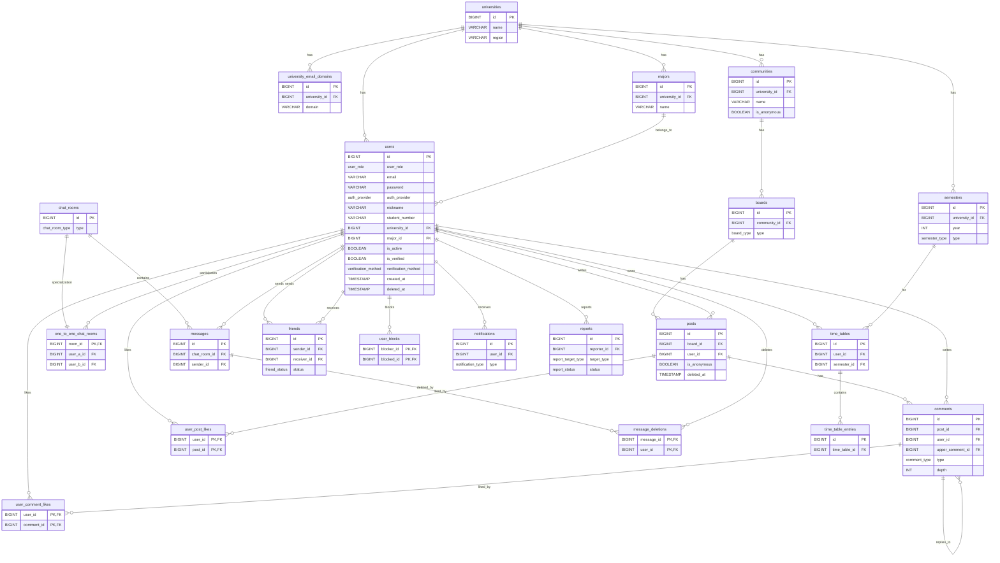

# 🟦 Nonstop App ERD

**Golden Master v2.2**

---

## 📌 Enum Definitions

```mermaid
erDiagram

  users {
    BIGINT id PK
    user_role user_role
    VARCHAR email
    VARCHAR password
    auth_provider auth_provider
    VARCHAR nickname
    VARCHAR student_number
    BIGINT university_id FK
    BIGINT major_id FK
    BOOLEAN is_active
    BOOLEAN is_verified
    verification_method verification_method
    TIMESTAMP created_at
    TIMESTAMP deleted_at
  }

  universities {
    BIGINT id PK
    VARCHAR name
    VARCHAR region
  }

  university_email_domains {
    BIGINT id PK
    BIGINT university_id FK
    VARCHAR domain
  }

  majors {
    BIGINT id PK
    BIGINT university_id FK
    VARCHAR name
  }

  semesters {
    BIGINT id PK
    BIGINT university_id FK
    INT year
    semester_type type
  }

  communities {
    BIGINT id PK
    BIGINT university_id FK
    VARCHAR name
    BOOLEAN is_anonymous
  }

  boards {
    BIGINT id PK
    BIGINT community_id FK
    board_type type
  }

  posts {
    BIGINT id PK
    BIGINT board_id FK
    BIGINT user_id FK
    BOOLEAN is_anonymous
    TIMESTAMP deleted_at
  }

  comments {
    BIGINT id PK
    BIGINT post_id FK
    BIGINT user_id FK
    BIGINT upper_comment_id FK
    comment_type type
    INT depth
  }

  user_post_likes {
    BIGINT user_id PK, FK
    BIGINT post_id PK, FK
  }

  user_comment_likes {
    BIGINT user_id PK, FK
    BIGINT comment_id PK, FK
  }

  chat_rooms {
    BIGINT id PK
    chat_room_type type
  }

  one_to_one_chat_rooms {
    BIGINT room_id PK, FK
    BIGINT user_a_id FK
    BIGINT user_b_id FK
  }

  messages {
    BIGINT id PK
    BIGINT chat_room_id FK
    BIGINT sender_id FK
  }

  message_deletions {
    BIGINT message_id PK, FK
    BIGINT user_id PK, FK
  }

  time_tables {
    BIGINT id PK
    BIGINT user_id FK
    BIGINT semester_id FK
  }

  time_table_entries {
    BIGINT id PK
    BIGINT time_table_id FK
  }

  friends {
    BIGINT id PK
    BIGINT sender_id FK
    BIGINT receiver_id FK
    friend_status status
  }

  user_blocks {
    BIGINT blocker_id PK, FK
    BIGINT blocked_id PK, FK
  }

  notifications {
    BIGINT id PK
    BIGINT user_id FK
    notification_type type
  }

  reports {
    BIGINT id PK
    BIGINT reporter_id FK
    report_target_type target_type
    report_status status
  }

  %% =====================
  %% Relationships
  %% =====================

  universities ||--o{ users : has
  universities ||--o{ majors : has
  universities ||--o{ communities : has
  universities ||--o{ semesters : has
  universities ||--o{ university_email_domains : has

  majors ||--o{ users : belongs_to

  communities ||--o{ boards : has
  boards ||--o{ posts : has
  users ||--o{ posts : writes
  posts ||--o{ comments : has
  users ||--o{ comments : writes
  comments ||--o{ comments : replies_to

  users ||--o{ user_post_likes : likes
  posts ||--o{ user_post_likes : liked_by

  users ||--o{ user_comment_likes : likes
  comments ||--o{ user_comment_likes : liked_by

  chat_rooms ||--o{ messages : contains
  users ||--o{ messages : sends

  chat_rooms ||--|| one_to_one_chat_rooms : specialization
  users ||--o{ one_to_one_chat_rooms : participates

  messages ||--o{ message_deletions : deleted_by
  users ||--o{ message_deletions : deletes

  users ||--o{ time_tables : owns
  semesters ||--o{ time_tables : for
  time_tables ||--o{ time_table_entries : contains

  users ||--o{ friends : sends
  users ||--o{ friends : receives

  users ||--o{ user_blocks : blocks

  users ||--o{ notifications : receives
  users ||--o{ reports : reports
```

---
